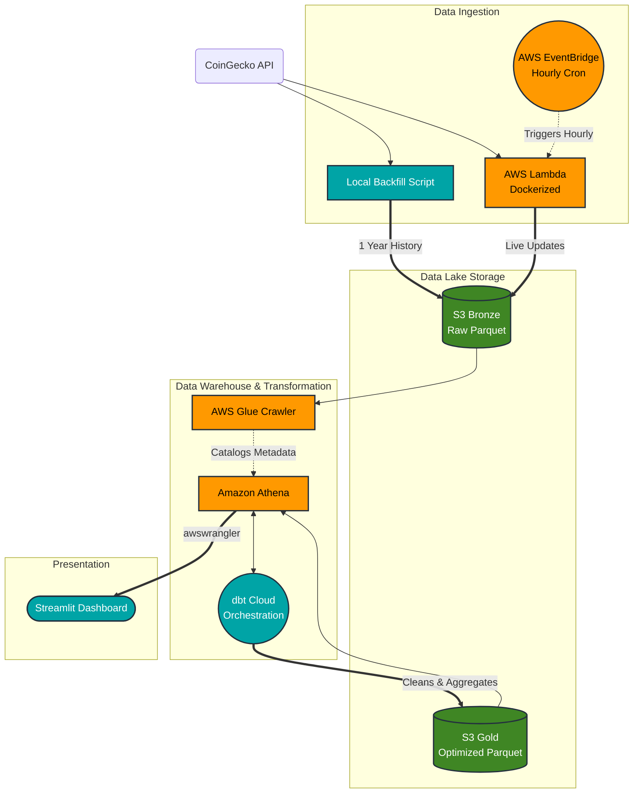

# 📈 Crypto Market Pulse: A Serverless Lakehouse

## 🌐 Live Dashboard
**View the live, interactive data product here:** 👉 [Crypto Market Pulse Dashboard](https://crypto-pulse-lakehouse.streamlit.app/) 👈

---

## 🎯 Problem Statement
Cryptocurrency markets operate 24/7, making it difficult to maintain a unified, highly accurate dataset that seamlessly bridges deep historical data with live, up-to-the-minute price action. 

This project solves that problem by building a **fully automated, serverless Medallion Data Lakehouse**. It ingests a year of historical backfill data and seamlessly merges it with live hourly updates from the CoinGecko API. The pipeline automatically deduplicates overlapping records, calculates 24-hour moving averages, tracks market cap dominance, and serves the optimized data to a highly interactive, professional-grade Streamlit dashboard.

---

## 🛠️ Technology Stack & Architecture Design
The Data Engineering curriculum extensively covers fundamental concepts using Google Cloud Platform (GCP) and traditional always-on orchestration tools. For this capstone, I applied those core engineering principles but pivoted to a **fully Serverless architecture on AWS** to challenge myself with event-driven design and minimize idle computing costs.

### 1. Infrastructure as Code (IaC) & Containerization
* **Terraform:** Used to declaratively provision all AWS resources (S3, ECR, IAM, Lambda, EventBridge, Glue). To ensure zero local dependencies, Terraform is executed via a Dockerized `Makefile`.
* **Docker:** Packages Python ingestion scripts. Using Docker images for AWS Lambda bypasses standard zip size limits and allows for heavy libraries like `pandas` and `pyarrow`.

### 2. Orchestration (The Serverless Pivot)
* **AWS EventBridge & dbt Cloud:** Instead of always-on servers (like Airflow or Mage), I used an event-driven approach. **EventBridge** triggers the Lambda ingestion, and **dbt Cloud** handles downstream transformations. You only pay for the seconds the code is running.

### 3. Data Lake Storage & Formats
* **AWS S3:** Serves as the foundation of the Medallion Lakehouse (Bronze/Gold zones).
* **Parquet:** Data is converted to columnar Parquet in-memory before upload, drastically reducing storage costs and accelerating query speeds via Athena.

### 4. Data Warehouse & Query Engine
* **AWS Athena + AWS Glue:** A true Lakehouse approach. **AWS Glue** catalogs metadata, while **Amazon Athena** (serverless Presto) allows for standard SQL queries directly against S3 files without the need for a traditional database.
* **Optimization & Partitioning:** The data lakehouse implements a hierarchical partitioning strategy (`year/month/day/hour`). This design enables **Predicate Pushdown** in Athena; when the dashboard queries the last 7 days of data, the engine scans only the relevant S3 prefixes. This minimizes data processed per query, ensuring sub-second response times and staying strictly within the AWS Free Tier usage limits.

### 5. Transformations (dbt)
* **dbt Core (dbt-athena):** Implements the Medallion architecture. It handles deduplication in the Silver layer and materializes business logic (moving averages/percentage changes) in the Gold layer.

### 6. Dashboard Integration
* **Streamlit:** A custom Python web app that uses `awswrangler` to pull Athena results into interactive Plotly visualizations.

---

## ⏱️ Strategic Batching vs. Streaming (Cost Optimization)
This project uses an **hourly micro-batch pipeline** to remain 100% within free-tier limits:

* **CoinGecko API:** The free tier allows 10,000 calls/month. Streaming would exceed this. Hourly ingestion uses only ~744 calls/month.
* **dbt Cloud:** The Developer tier allows 3,000 successful runs/month. Hourly scheduling uses exactly 744 runs/month.

---

## 🏗️ Pipeline Flow

1. **The Backfill (One-Off):** A Python script fetches 1 year of historical data from CoinGecko, converts it to Parquet, and uploads it to the Bronze S3 bucket.
2. **Live Ingestion (Hourly Batch):** AWS EventBridge triggers the Dockerized AWS Lambda function every hour. Because the rule was activated immediately following the backfill, its natural execution time (**11 minutes past the hour**) perfectly maintains a continuous 60-minute interval.
3. **The Data Catalog:** An AWS Glue Crawler runs automatically at **15 minutes past every hour** (via cron schedule `15 * * * ? *`), detecting new S3 partitions and updating the metadata.
4. **Transformation:** dbt Cloud triggers at **20 minutes past every hour**, running data quality tests and materializing the optimized Gold table in Athena.
5. **Dashboard:** Streamlit queries the Gold table in Athena to visualize the market analytics.

---



---

## 📂 Project Directory Structure

```text
crypto-pulse-lakehouse/
├── notebook/
│   └── explore_api.ipynb         # Initial API testing and schema exploration
├── src/
│   ├── historical_backfill.py    # Extracts 1-year history to S3
│   └── lambda_function.py        # Dockerized Lambda for hourly ingestion
├── transform/                    # dbt project (Silver & Gold layers)
│   ├── analyses/
│   ├── macros/
│   ├── models/                   # Contains stg_crypto_prices and fct_crypto_market_pulse
│   ├── seeds/
│   ├── snapshots/
│   ├── tests/                    # Custom data quality tests
│   ├── .gitignore
│   ├── dbt_project.yml           # dbt configuration
│   └── README.md                 # dbt documentation
├── .env.example                  # Template for environment variables
├── .gitignore                    # Root Git ignore file
├── .python-version               # Python version specification
├── .terraform.lock.hcl           # Terraform dependency lock file
├── app.py                        # Streamlit dashboard application
├── Dockerfile                    # Container definition for AWS Lambda deployment
├── main.tf                       # Terraform declarative infrastructure definitions
├── Makefile                      # Command shortcuts for the entire pipeline
├── pyproject.toml                # Dependencies managed by 'uv'
├── README.md                     # Project documentation
└── uv.lock                       # Deterministic dependency lockfile
```
*(Note: Ignored files and directories such as `.venv`, `.terraform`, `data/`, `logs/`, `.env`, and terraform state files are excluded from this tree).*

---

## 📊 The Dashboard
The Streamlit dashboard delivers a professional, trading-platform-style UI driven by a global asset selector:

* **Global Control:** A unified dropdown menu to switch assets and instantly update all downstream metrics.
* **Top-Level Metrics:** Dynamic KPI cards for current price, 24h percentage change, and total market cap.
* **Temporal Analysis:** Interactive Plotly time-series chart visualizing the 7-day trend with a 24h moving average.
* **Categorical Composition:** Pie and Bar charts comparing the selected asset's market cap against the rest of the market.

---

## 🚀 Reproducibility

### Step 1: Environment Setup
Clone the repository and install dependencies:
```bash
echo 'COINGECKO_API_KEY="your_api_key_here"' > .env
make setup
```

### Step 2: Deploy Infrastructure
```bash
make tf-init
make tf-apply
```

### Step 3: Backfill & Lambda Deployment
```bash
make docker-push
make backfill
```

### Step 4: Run Transformations & Launch
```bash
make dbt-run
make dashboard
```

### Teardown
To avoid AWS charges, destroy all infrastructure when finished:
```bash
make tf-destroy
```
